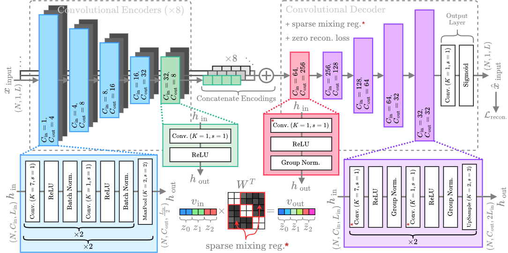

# Self-Supervised Autoencoder Network for Robust Heart Rate Extraction from Noisy Photoplethysmogram

**Paper Links:** [arXiv](https://arxiv.org/abs/2309.07138) [[pdf](https://arxiv.org/pdf/2309.07138.pdf)]

## Abstract
Biosignals can be viewed as mixtures measuring particular physiological events, and blind source separation (BSS) aims to extract underlying source signals from mixtures. This paper proposes a self-supervised multi-encoder autoencoder (MEAE) to separate heartbeat-related source signals from photoplethysmogram (PPG), enhancing heart rate (HR) detection in noisy PPG data. The MEAE is trained on PPG signals from a large open polysomnography database without any pre-processing or data selection. The trained network is then applied to a noisy PPG dataset collected during the daily activities of nine subjects. The extracted heartbeat-related source signal significantly improves HR detection as compared to the original PPG. The absence of pre-processing and the self-supervised nature of the proposed method, combined with its strong performance, highlight the potential of BSS in biosignal analysis.

    
  

      Figure 1. Diagram outlining the architecture of the proposed multi-encoder autoencoder used in this study to extract heart-related source signal from photoplethysmogram.
  

    
    

      Figure 2. Diagram showing the inference step for the proposed method. An encoder is selected, and the output from all other encoders are masked with zeros. Then the encodings are passed to the decoder, yielding a source prediction corresponding to the selected encoder. $\hat{S}_n$ is the nth predicted source corresponding to the nth encoder, $E_n$.
  

# Experiments
You can request access to the Multi-Ethnic Study of Atherosclerosis (MESA) Sleep study[^1][^2] data [here](https://sleepdata.org/datasets/mesa). After downloading the dataset, set the `DATA_PATH` variable and run: `python generate_mesa_data.py`

To train a model with our configuration use the following command: `python trainer.py experiment_config=mesa_ppg_bss`

# Results

### References
[^1]: Zhang GQ, Cui L, Mueller R, Tao S, Kim M, Rueschman M, Mariani S, Mobley D, Redline S. The National Sleep Research Resource: towards a sleep data commons. J Am Med Inform Assoc. 2018 Oct 1;25(10):1351-1358. doi: 10.1093/jamia/ocy064. PMID: 29860441; PMCID: PMC6188513.
[^2]: Chen X, Wang R, Zee P, Lutsey PL, Javaheri S, Alcántara C, Jackson CL, Williams MA, Redline S. Racial/Ethnic Differences in Sleep Disturbances: The Multi-Ethnic Study of Atherosclerosis (MESA). Sleep. 2015 Jun 1;38(6):877-88. doi: 10.5665/sleep.4732. PMID: 25409106; PMCID: PMC4434554.